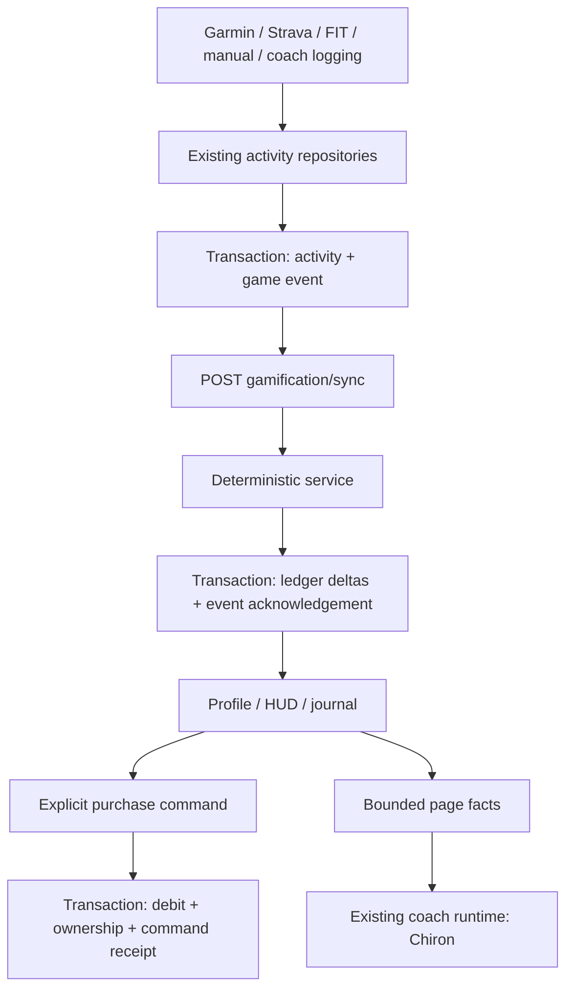

# Arete — athlete RPG and Chiron system design

## 1. Problem

Arete’s existing `PlayerStats.xp` measures weekly training load (TSS), and its level measures a streak. Neither is a permanent RPG balance. The new experience gives completed training a separate, deterministic progression and a cosmetic currency, without increasing model calls or replacing the current UI.

The approved reference is [Profil / Chiron / themes in Figma](https://www.figma.com/design/gzX3POjHbPbtjw8I1Nz8Vj?node-id=86-3433). Inter, JetBrains Mono, the current navigation and the original cartoon assets are retained.

## 2. Context

FastAPI + DuckDB own account state; React Query reads it. Garmin, Strava, FIT, manual entry and coach strength logging converge on existing repositories. Browser conversations remain authoritative. The existing document upload, extraction, source review and confirmed planning import flows are reused.

This document describes the implementation in this PR. The Figma exploration contains additional future states; it is not evidence that those states are implemented.

## 3. Goals and boundaries

- Default-off account setting enables Profile, rewards, collection and Chiron’s attachment composer.
- One durable server ledger owns XP and Éclats. Browser arithmetic never grants rewards.
- Purchase, ownership and debit commit atomically; equipping is a separate free command.
- Opt-out retains XP, balance, outfits and conversations. Reactivation does not reward disabled periods.
- Original Performance and Odyssey palettes remain optional appearance preferences.
- No extra model requests, calorie/weight/Z5 multiplier, random loot, real-money purchase or physiological benefit from equipment.

## 4. Architecture and contracts

### Ownership

| Owner | Responsibility |
| --- | --- |
| `dataio/game_schema.py` | Additive migration 19; seven game tables, no activity backfill |
| `dataio/game_events.py` | Capture immutable eligibility evidence in the source transaction |
| `services/gamification.py` | Rules, projection, settings, purchase, appearance and equipment |
| `api/gamification.py` | HTTP validation and visible 409 conflict responses |
| `services/pages.py` | Server-derived player summary and opt-in Chiron identity |
| `frontend/src/lib/gamification.ts` | Typed HTTP client, query and asset lookup |
| `pages/Profile.tsx` | Overview, achievements, records, history, collection |
| `useCoachThreads` / `DocumentAttachments` | Conversation-owned attachment selection and existing uploads |

`game_profile` owns enabled/version/class/equipment. `game_periods` records opt-in intervals. `game_events` owns source and canonical identities, eligibility and pending status. `game_weeks` freezes the goal and timezone when first created. `game_ledger` is append-only XP/Éclat deltas. `game_owned` records owned skins. `game_commands` stores purchase fingerprints and receipts.

### Economy

- Twenty levels: threshold for level n is `50 × n × (n − 1)` XP. Level 20 is the maximum; XP can keep accumulating.
- Ranks start at levels 1, 3, 6, 10, 15 and 20: Novice, Initié, Adepte, Expert, Maître, Légende.
- A valid completed session awards 50 XP and 10 Éclats. Only the first six eligible canonical sessions of a week earn currency; subsequent sessions still count toward milestones.
- Reaching the frozen weekly training goal awards 200 XP and 40 Éclats. An applied, non-reverted prescribed rest counts once per planned session after its date, provided no actual activity links to that planned session. Rest earns no session reward.
- Milestone badges: 5, 20, 50, 100 sessions. Classes do not alter reward rates.
- Initial catalogue: original outfit, free Adepte cape at level 6, Éclipse for 300 Éclats, Souverain for 600. Class changes preserve progress and ownership.
- Missing heart-rate data stays non-measured; HR does not participate in the reward calculation.

The weekly objective is the existing training-count preference plus applied rest decisions. This release does **not** implement a new versioned prescription-compliance engine or a talent tree.

### Eligibility and corrections

A source must be valid, saved while opted in, dated no more than 14 days ago and not in the future. Timestamped imports must fall inside an enabled interval. A date-only import must have its entire day inside an enabled interval; manual logging today is accepted explicitly. Activities already present at activation are not backfilled.

Source IDs prevent replay credits; canonical IDs consolidate repeated external activity identities. Existing strength-to-actual links are resolved before projection. Unlinking does not recreate a previously consolidated reward. A late merge or deletion produces compensating ledger entries rather than editing old receipts. This can reduce XP or make the Éclat balance negative after spending; owned skins remain, and future earnings repay the deficit. An ordinary pause never subtracts XP.

Each projection acknowledges at most 100 pending source events. It recomputes their affected weeks and the active current week, including already captured events in each week. Each week is bounded to 1,000 canonical activities/receipts; overflow fails explicitly. Remaining pending evidence stays visible. Thus the 100-event bound is an acknowledgement batch, not a promise of only 100 ledger operations.

### Concurrency and failure

Commands acquire a conflicting write on the singleton profile row inside a DuckDB transaction. There is no automatic transaction retry. Settings, appearance and equipment use a version precondition. Purchases use an idempotency key plus payload fingerprint, validate the server price/level/balance and commit debit, ownership and receipt together. Reusing the key returns its original receipt; reusing it with another payload fails. Buying an already owned item cannot debit again.

Pending events block purchases until projection is refreshed. On an ambiguous network failure, the UI offers refresh of balance and ownership and retains the purchase key while its dialog remains open. It never optimistically spends currency or equips an unconfirmed item. A duplicate correction may create debt; a purchase cannot.

The source transaction includes event capture, so an event failure rolls back that activity write. A projection failure leaves the saved activity and evidence intact for an explicit retry. The rest of the app remains accessible; a failed progression read is shown as an error, never a fabricated zero.

### HTTP API

All paths have `/api` prefix.

| Method | Path | Contract |
| --- | --- | --- |
| GET / PATCH | `/settings/gamification` | Effective flag, opted-in value, deployment availability, version; PATCH requires version |
| GET | `/gamification?offset=0` | Read-only snapshot; 50 receipts/page, bounded offset |
| POST | `/gamification/sync` | Bounded, idempotent projection followed by snapshot |
| POST | `/gamification/purchases` | `key`, `skin`, `expected_price`; durable receipt |
| PUT | `/gamification/equipment` | Owned `skin` and profile `version` |
| PUT | `/gamification/appearance` | Validated class, reserved silhouette preference and `version` |
| GET | `/analytics/sessions/{id}` | Exact source activity for a measured record |

### Chat and documents

Chiron uses the current model routing, permissions, prompts, SSE, tool budgets and journal owner. The opt-in persona is supplied with server page facts. Profile facts contain level, rank, XP, balance, sessions, equipment and weekly summary; no raw game ledger is injected. There is no reward tool for the model.

The compact composer supports picker, file drop, pasted files, upload progress/cancel, preview and removable draft chips. Removing a chip retains the original file. Permanent deletion is separate. Each sent user message stores attachment IDs. The request carries the union referenced by its bounded history, at most 20 documents. The server rejects a missing, incomplete or foreign-thread selection instead of silently mounting another file. Legacy requests without `document_ids` retain the previous all-thread behavior; an empty list mounts none.

Existing limits remain: five files per drop, 20 MiB per file, 3 MiB chunks, explicit request timeouts. Interrupted uploads remain visible; automatic chunk resume is not claimed. Failed messages and their attachment references stay in the conversation for explicit retry. Uploading or confirming a planned workout does not earn XP; completed activity capture is the reward boundary.

### Cost envelope

Reward calculation, settings, purchase and equipment use **zero model requests**. Page enrichment adds no model round-trip. The browser makes one preference request (shared query cache), then one projection/snapshot request when an opted-in summary/profile is loaded. Sync makes bounded per-week and per-event database operations; production MotherDuck latency has not been benchmarked. Existing model/runtime budgets are unchanged.

## 5. Rollout

Migration 19 creates empty game tables and a profile with `enabled=false`. No existing XP-looking TSS field is migrated. The user activates **Réglages → Gamification → Activer la gamification**. A separate endpoint prevents an older general-settings PUT from resetting this choice. BroadcastChannel invalidation and focus refetch update other browser tabs.

`GAMIFICATION_ENABLED=false` is the deployment kill switch. It hides the effective experience and rejects projection/purchase/equipment/appearance; persisted opt-in and evidence remain intact. Re-enabling it can settle retained evidence. Opt-out closes the account interval and excludes new activity evidence, while valid pre-opt-out evidence remains settleable. General appearance themes remain available independently.

Rollback: disable the deployment flag, retain the additive tables and deploy the previous UI if required. Do not drop the ledger or run a destructive reverse migration. Production activation remains voluntary after merge.

## 6. Guardrails and known limits

- Four classes × six ranks and Chiron use local SVG exports from the approved Figma. The current editor changes class. Independent silhouette artwork across every class/outfit is not delivered; the reserved silhouette field does not imply a visible body editor.
- The profile reuses measured cardio records, estimated-versus-real strength PRs and existing session history. It does not invent records or seed Figma fixture balances.
- Weekly goal and activity timezone are stored when evidence is captured. Historical reward weeks are not rebucketed when a timezone preference changes. Cross-timezone travel and historical rest corrections deserve follow-up before broadening this single-athlete rollout.
- Current-week rest changes are reconciled on sync. There is no background worker for historical rest-only changes with no pending activity event.
- Cosmetic rank artwork is reused for the small initial catalogue. A broader skin catalogue, talent tree and cinematic level-up flow remain separate from this release.
- Chiron’s visual identity and chat page context are implemented here; scheduled briefing/feedback prompts remain on their existing contracts.
- Tests use an isolated local database. No direct MotherDuck mutation or live model evaluation is part of verification.

## 7. Verification and operations

`make check` is the release gate: lint/format, mypy, backend tests, frontend tests and production build. Boundary tests cover activation intervals, no backfill, caps, level thresholds, atomic capture, canonical replay, compensating entries, prescribed rest, frozen goals, concurrent purchases, idempotent replay, ownership, settings compatibility and selected-document isolation.

Frontend tests cover disabled direct profile access, confirmed purchase before equip and failed preference writes. Browser QA exercises desktop/mobile navigation, opt-in/out, themes, source document upload/preview and persisted message selection with model responses stubbed. Screenshots live under untracked `.context/`.

Operational signals: `pending` in snapshots, visible 409 command conflicts, signed correction receipts and existing API errors. No new silent recovery loop. A stuck projection should be inspected against its durable source events before any manual correction.

## 8. Before / after example

Before: weekly TSS was labelled XP and did not represent a spendable economy.

After (illustrative only): 1,520 XP and 340 Éclats → explicit Éclipse purchase → 40 Éclats → one session completing the weekly objective → 1,770 XP and 90 Éclats. Level 6 spans 1,500–2,100 XP, so the progress bar reads 270 / 600. The model explains those server facts; it never awards them.

The HUD keeps training recovery separate. Profile owns permanent accomplishments and collection. Settings controls whether that experience is shown.

## 9. Result

One optional RPG experience shares the current Arete shell on desktop and mobile. Rewards and purchases are durable deterministic commands, and Chiron remains the existing coach with an identifiable portrait and explicit document context. The initial rollout is intentionally account-opt-in, with the remaining design scope recorded above rather than represented as working functionality.
