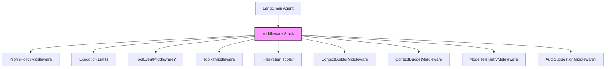

## Overview

The Arete coaching system uses a modular agent framework built with LangChain. Agents are assembled from profiles that define their capabilities, instructions, and behavior. The runtime manages context, tool execution, and middleware policies.

## Agent Profiles

Profiles are defined in `src/arete/agent/profiles/catalog.py` and consist of:
- An identifier (`chat`, `briefing`, `feedback`, `review`)
- A human-readable name
- Instructions (system prompt)
- A tuple of capability IDs (toolkits) that the agent can use
- Flags for preloaded capabilities, training writes, page context, and journal tools

<!-- openwiki: broken internal link [../agent/profiles/models.py] file "../agent/profiles/models.py" does not exist. Fix the href or restore the target, then delete this comment. -->
Each profile is instantiated as an `AgentProfile` (see [models.py](../agent/profiles/models.py)). The `chat` profile is the primary interactive agent, while `briefing`, `feedback`, and `review` are specialized for specific tasks without tool bindings.

## Capabilities (Toolkits)

Capabilities are registered in `src/arete/agent/capabilities/registry.py`. Each toolkit includes:
- A set of tools (functions)
- Instructions for the agent on how to use the tools
- Read-only tools (for safe operations)

<!-- openwiki: broken internal link [../agent/capabilities/registry.py#L10-L134] file "../agent/capabilities/registry.py" does not exist. Fix the href or restore the target, then delete this comment. -->
The registry exposes a `CAPABILITIES` dictionary mapping IDs to `Toolkit` objects. Toolkits are loaded per agent run based on the profile's `capabilities` and `preloaded` fields. Instructions are natural-language rules that guide the agent's tool usage (see [registry.py](../agent/capabilities/registry.py#L10-L134)).

## Agent Factory and Middleware

The `build_agent` function in `src/arete/agent/factory.py` constructs an agent by:
1. Creating a middleware stack that includes:
   - `ProfilePolicyMiddleware` (enforces profile-specific policies)
   - Execution limits (from `execution_limits()`)
   - `ToolEventMiddleware` (if page context is enabled)
   - `ToolkitMiddleware` (loads the selected toolkits)
   - Filesystem tools (if journal tools are enabled)
   - `ContextBuilderMiddleware` and `ContextBudgetMiddleware`
   - `ModelTelemetryMiddleware`
   - Optional `AutoSuggestionMiddleware` (for chat profile when a suggestion model is provided)
2. Assembling the tools based on the profile's flags (`page_context` and `journal_tools`)
3. Creating the LangChain agent with the model, tools, middleware, system prompt from the profile, and context schema (`AgentContext`).

The middleware order is significant: each middleware wraps the next, forming a pipeline that processes the agent's thoughts and actions.

## Runtime Context

The `AgentContext` (in `src/arete/agent/runtime/context.py`) is passed to each agent run and contains:
- The source dictionary (from the API layer) which may include panel context
- The selected profile (resolved to an `AgentProfile`)
- Calendar service (if needed)
- Thread ID for conversation tracking
- Flags for suggestion reply, attachment manifest, and import pending
- Current date and deadline
- Runtime statistics (model calls, tool calls, etc.)
- Page section (from the panel context)
- A semaphore for limiting tool concurrency

<!-- openwiki: broken internal link [../agent/runtime/context.py] file "../agent/runtime/context.py" does not exist. Fix the href or restore the target, then delete this comment. -->
See [context.py](../agent/runtime/context.py) for the full definition.

## Execution Flow

When a request comes in:
1. The API layer (in `arete.api`) prepares the `AgentContext`, including stamping the panel context.
2. The context is passed to the agent factory to build (or retrieve a cached) agent.
3. The agent processes the user message, invoking tools as needed through the middleware.
4. The middleware handles cross-cutting concerns like policy, context budgeting, and telemetry.
5. The agent returns a response, which is sent back via the API.

## Claims

<!-- openwiki: broken internal link [src/arete/agent/factory.py] file "src/arete/agent/factory.py" does not exist. Fix the href or restore the target, then delete this comment. -->
- The Arete coaching system uses a modular agent framework built with LangChain, assembling agents from profiles that define capabilities, instructions, and behavior [factory.py](src/arete/agent/factory.py).
<!-- openwiki: broken internal link [src/arete/agent/factory.py] file "src/arete/agent/factory.py" does not exist. Fix the href or restore the target, then delete this comment. -->
- Agents are constructed by the `build_agent` function, which creates a middleware stack including `ProfilePolicyMiddleware`, execution limits, `ToolkitMiddleware`, filesystem tools (when enabled), `ContextBuilderMiddleware`, `ContextBudgetMiddleware`, `ModelTelemetryMiddleware`, and optionally `AutoSuggestionMiddleware` [factory.py](src/arete/agent/factory.py).
<!-- openwiki: broken internal link [src/arete/agent/profiles/catalog.py] file "src/arete/agent/profiles/catalog.py" does not exist. Fix the href or restore the target, then delete this comment. -->
- Four main profiles exist: `chat` (primary interactive agent), `briefing`, `feedback`, and `review` [catalog.py](src/arete/agent/profiles/catalog.py).
<!-- openwiki: broken internal link [src/arete/agent/capabilities/registry.py] file "src/arete/agent/capabilities/registry.py" does not exist. Fix the href or restore the target, then delete this comment. -->
- Capabilities (toolkits) are registered in `CAPABILITIES` in `registry.py` as `Toolkit` objects containing a set of tools, instructions, and read-only tool allowlists [registry.py](src/arete/agent/capabilities/registry.py).
<!-- openwiki: broken internal link [src/arete/agent/runtime/context.py] file "src/arete/agent/runtime/context.py" does not exist. Fix the href or restore the target, then delete this comment. -->
- The `AgentContext` (in `context.py`) is the per-run context carrying the source dictionary, selected profile, calendar service, thread ID, stats, page section, and tool concurrency semaphore [context.py](src/arete/agent/runtime/context.py).

## Middleware Pipeline Diagram

The following diagram illustrates the middleware stack as assembled in `build_agent`:

Note: Conditional middleware (marked with `?`) are included only when specific profile flags or configurations are set.

## Extension Points

- **New capabilities**: Add a new `Toolkit` to `CAPABILITIES` in `registry.py` and reference it in a profile's `capabilities`.
- **New profiles**: Define a new `AgentProfile` in `catalog.py` and add it to the `PROFILES` dictionary.
- **Middleware customization**: Modify the middleware list in `build_agent` to insert or replace middleware components.

## Related Documentation

<!-- openwiki: broken internal link [../architecture.md] file "../architecture.md" does not exist. Fix the href or restore the target, then delete this comment. -->
- See [Architecture](../architecture.md) for how the agent system fits into the broader application.
<!-- openwiki: broken internal link [../services.md] file "../services.md" does not exist. Fix the href or restore the target, then delete this comment. -->
- See [Services](../services.md) for domain services that the agent tools may invoke.
