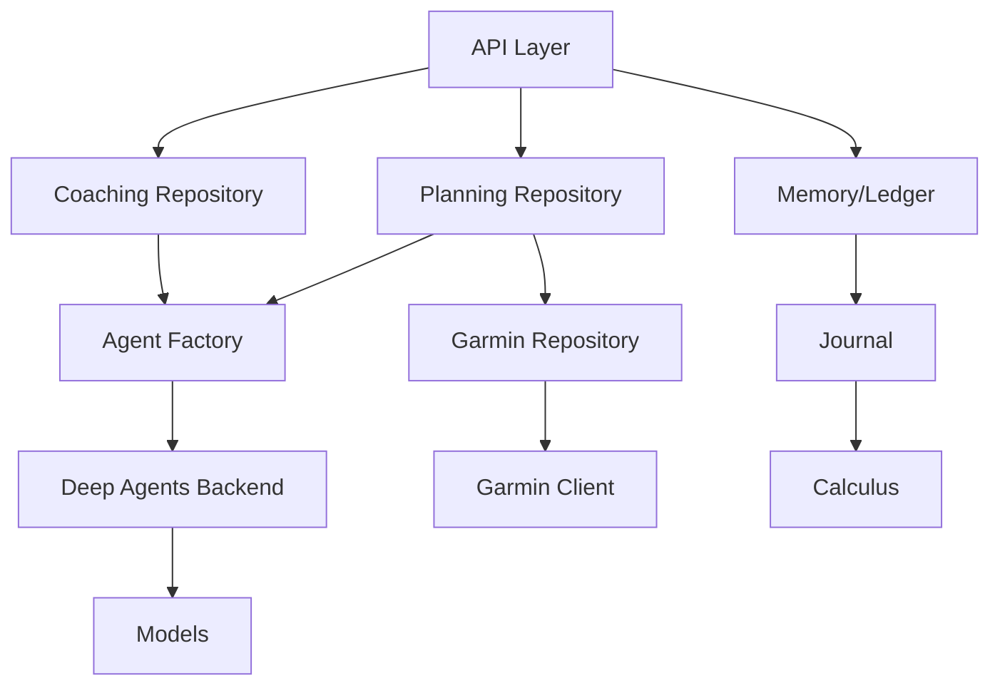

# Services Layer

The Services Layer is the core infrastructure that orchestrates Arete's coaching and planning capabilities. It separates domain logic from the agent framework, providing a stable interface for composing agents, managing sessions, and adapting plans based on real-world feedback.

## Overview

Arete's services layer sits between the user-facing API and the underlying agent framework. It handles high-level coordination tasks such as generating daily briefings, building and updating training plans, collecting post-session feedback, and adapting schedules based on athlete performance and goals.

## Core Services

### Briefing Service

The `briefing` service produces daily coaching briefings. It computes a deterministic floor of advice (via rule-based tips) and combines it with actual session data to create a comprehensive briefing. Briefings are triggered by the scheduler after a successful sync or via the `GET /tips/daily` endpoint. The service ensures that even if the model encounters failures during tool calls, the briefing still succeeds by falling back to rule-based guidance.

Key responsibilities:
- Generate daily coaching tips based on rule-based logic
- Load and format session data (load, form, recovery, today's plan)
- Combine model outputs with rule floors to guarantee a meaningful briefing
- Persist briefing summaries to the journal for later reference

### Planning Service

The `planning` service manages goal-driven training plans. It builds periodized plans based on recent athletic performance, target times, and rest preferences. Plans are stored in the database and can be queried to list upcoming sessions.

Key responsibilities:
- Create, list, and update planned training sessions
- Generate periodized plans using recent running data and target paces
- Support goal-based planning (races, endurance targets)
- Provide APIs for retrieving and modifying planned sessions

### Feedback Service

The `session_feedback` service handles post-session feedback. After a session is completed, coaches can write feedback that is recorded in the journal and linked to the session entry. This feedback informs future adaptations and helps close the loop between practice and performance.

Key responsibilities:
- Accept coach-written feedback for completed sessions
- Store feedback in the journal ledger with proper attribution
- Associate feedback with specific sessions for traceability

### Memory & Ledger Service

The `memory` service manages long-term state through a ledger system. It maintains session journals, notes, and archived entries, ensuring that historical data remains accessible while keeping the active ledger bounded in size.

Key responsibilities:
- Append dated entries to session and notes ledgers
- Rotate old entries to monthly archives when the ledger exceeds size limits
- Maintain bounded growth of historical records

### Calendar Service

The `calendar` service integrates with Google Calendar to manage scheduling. It handles event creation, authorization, and synchronization with the athlete's external calendar.

Key responsibilities:
- Create and manage calendar events for training sessions
- Handle user consent and authorization flows
- Synchronize schedule changes with the planning system

### Adaptation Service

The `adaptation` service applies daily decisions to the plan and adapts them based on athlete feedback. It evaluates whether a planned session should proceed, be modified, or be skipped, and writes the adapted plan back to the system.

Key responsibilities:
- Evaluate morning decisions against actual conditions
- Decide which sessions to execute and which to adjust
- Write adapted plans to the planning repository

## Component Interactions

1. **API Layer** (`arete/api`) prepares context and dispatches requests to the services.
2. **Coaching Repository** (`briefing.py`, `session_feedback.py`) coordinates briefings and feedback.
3. **Planning Repository** (`planning.py`, `goals.py`) manages session schedules and goal progress.
4. **Memory/Ledger** (`memory.py`) persists session history and rotates old entries.
5. **Calendar Service** (`calendar.py`) syncs training sessions with external calendars.
6. **Adaptation Service** (`plan_adaptation.py`) applies daily decisions to the plan.
7. **Deep Agents Backend** (`backends/`) provides low-level memory file system access.

## Data Flow

1. **Daily Cycle**:
   - Scheduler triggers briefing generation → `briefing.py` computes and stores the briefing
   - Planner builds or updates the training plan → `planning.py` interacts with `goals.py` and `garmin_repository.py`
   - After session completion, feedback is submitted → `session_feedback.py` appends to the journal
   - Adaptation service evaluates decisions and updates the plan → `plan_adaptation.py`
   - All changes are persisted through the memory ledger → `memory.py`

2. **State Management**:
   - Session state is managed through `AgentContext` (runtime/context.py) which carries profile, calendar, and statistics
   - Leading states include `pending`, `in_progress`, `completed`, and `failed`
   - The ledger (`sessions.md`, `notes.md`) serves as the authoritative record of all activities

## Lifecycle and Invariants

- **Briefing**: Always succeeds; falls back to rule-based tips if model calls fail
- **Planning**: Plans are periodic (weekly/monthly) and updated based on recent performance
- **Feedback**: Must be written by a coach; stored in the journal ledger
- **Memory**: Ledger grows continuously but is rotated to archives when exceeding size limits
- **Adaptation**: Decisions are applied immediately; athletes can override with a single click

## Configuration

Key configuration options include:
- `coach_briefing_enabled`: Whether athletes receive daily briefings (default: true)
- `auto_adapt_enabled`: Whether automatic plan adaptation is turned on (default: true)
- Rest day preferences and weekly training goals
- Performance metrics (VDOT, training loads, ACWR zones)

## Extension Points

New services can be added by implementing the `CoachingRepository` interface and registering them in the `coaching.py` factory. The middleware stack in `build_agent` allows inserting custom processing stages.

## Claims

- The `services/` package holds domain operations shared by HTTP routes, coaching tools and scheduled work, and is imported by the agent framework and the composition root without circular coupling.
- The briefing service is synchronous, writes its result to the journal ledger itself, and degrades to a deterministic rule-based tip floor when the model run fails.
- Post-session feedback is filed by the server in `sessions.md` (once, with server-dated headings) so the model cannot mutate training data or omit the write; the model only writes the feedback answer.
- The memory ledger appends dated entries, server-stamps headings, and rotates to a monthly archive when `sessions.md` exceeds 40,000 chars.
- Planning sessions created by the agent are stamped `source="coach"` so the Planning page can distinguish them.

## Summary

The Services Layer provides a decoupled, extensible foundation for Arete's coaching platform. By separating concerns into dedicated services (briefing, planning, feedback, memory, calendar, adaptation), the system achieves clear ownership boundaries, enables independent development, and supports ongoing evolution of features like advanced analytics, multi-sport support, and deeper integration with external devices.
